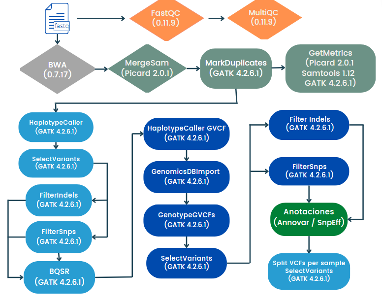

# Flujo de trabajo identificación de variantes de línea germinal utilizando NextFlow y GATK

Este pipeline realiza la identificación conjunta de variantes utilizando bootstrapping a partir de archivos de secuenciación masiva (WGS/WES).
Se desarrolló a partir del flujo de trabajo de buenas prácticas de GATK para el llamado conjunto de variantes germinal.
Particularmente, este flujo de trabajo es útil para especies diferentes al humano donde sólo se tenga la referencia sin los archivos con los sitios de snps e indels conocidos.

**Nota:** Por el momento el análisis sólo está disponible para datos de lectura corta (ilummina paired-end).

### Para solicitar este flujo de trabajo como servicio debes de entregar al personal de INMEGEN 

- Archivos de lectura fastq (Illumina paired-end).
- Archivo con la información experimental (identificador de la muestra, plataforma y librería de secuenciación, si son múltiples lanes especificar el número).
- En caso de WES especificar el kit utilizado (para generar un archivo bed)

## Instrucciones de uso 

Si deseas utilizar este flujo de trabajo sin apoyo del personal del INMEGEN sigue las siguientes instrucciones:

Asegurarse que se cuenta con [NextFlow](https://www.nextflow.io/docs/latest/index.html) (22.10.7), [Docker](https://docs.docker.com/) (23.0.5) y la imagen de docker pipe
linesinmegen/pipelines_inmegen:latest.

Se recomienda generar el índice de BWA a partir del archivo de referencia a usar.

 1. Seleccionar una ruta y el nombre para el directorio de salida
 2. Después generar el archivo sample_info.tsv con la información que se describe en la sección - Formato del archivo con la información de las muestras -
 3. Editar el archivo de nextflow.config con la siguiente información:

        - Ruta de los archivos *fastq*
        - Ruta del directorio de salida de nextflow
        - Nombre del proyecto 
        - Ruta del índice de BWA
        - Ruta del archivo sample_info.tsv
        - Nombre del índice de BWA
        - Ruta del archivo con la lista de intervalos
        - Condiciones del análisis (número de núcleos a utilizar por proceso, número de procesos simultáneos e información adicional)

  4. Ejecutar el comando: 

                bash run_nextflow.sh /path/to/out/dir

**Nota:** Para saber si con un sólo paso de bootstrapping es suficiente se recomienda revisar las tablas resultantes de AnalizeCovariantes, si fuera necesario añadir los pasos necesarios de bootstrapping faltantes.
#### Formato del archivo con la información de las muestras

Para tener un buen control de los archivos a procesar (formato fastq pareados {Read_1,Read_2}), en el archivo sample_info.tsv incluir la siguiente información por columna:
 
		Sample_ID	Sample_name	RG	PU	R1	R2

 - Sample_ID   = Nombre completo de los archivos e identificador de las muestras (debe poseer el nombre o identificador, el número de muestra y número de lane)
 - Sample_name = Nombre o identificador de la muestra (comprende el identificador y el número de muestra)
 - RG          = ReadGroup name -El nombre del grupo de lectura de las muestras a procesar
 - PU          = Plataforma + Libreria + número de lane
 - R1          = Ruta absoluta del archivo fastq R1
 - R2          = Ruta absoluta del archivo fastq R2

#### Las herramientas utilizadas para correr este flujo de trabajo son:
>
> - FastQC (0.11.9)
> - MultiQC (1.11)
> - Openjdk (11.0.13 o superior)
> - GATK (4.2.6.1)
> - BWA (0.7.17-r 1188)
> - Picard Tools (2.0.1)
> - Samtools (1.6.0)
> - bcftools (1.14)
>

## Diagrama de flujo del pipeline 

Para una mayor descripción de la información del pipeline ejecutado se anexa el siguiente diagrama de flujo basado en las buenas prácticas de GATK.

[Consulta el flujo de identificación de variantes germinal de GATK](https://gatk.broadinstitute.org/hc/en-us/articles/360035535932-Germline-short-variant-discovery-SNPs-Indels-)

