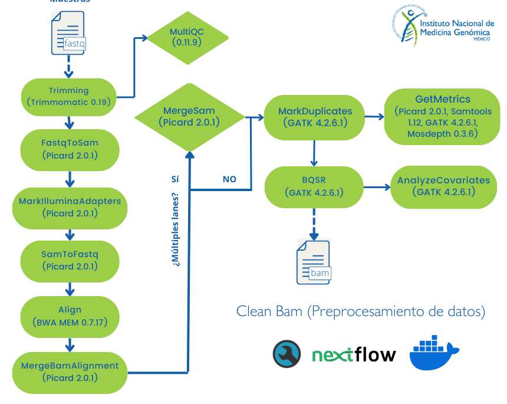

# Flujo de trabajo: Pre-procesamiento de datos para el descubrimiento de variantes con GATK

Con este pipeline se procesan archivos de secuenciación masiva (WGS/WES) en formato *fastq*. 
Con este flujo de trabajo de obtiene un archivo *.bam limpio como lo indica el siguiente [link](https://gatk.broadinstitute.org/hc/en-us/articles/360039568932--How-to-Map-and-clean-up-short-read-sequence-data-efficiently) de GATK, lo que es parte del pre-procesamiento de datos para el descubrimiento de variantes cuyo tutorial de gatk se encuentra [aquí](https://gatk.broadinstitute.org/hc/en-us/articles/360035535912-Data-pre-processing-for-variant-discovery)
Es necesario contar un un archivo *.tsv con la información de los archivos. También, es necesario el índice de [BWA](http://bio-bwa.sourceforge.net/) que corresponde al genoma de de referencia a emplear.
Si se trabajará con el genoma hg38 se pueden emplear los archivos del [bundle de GATK](https://console.cloud.google.com/storage/browser/genomics-public-data/resources/broad/hg38/v0;tab=objects?prefix=&forceOnObjectsSortingFiltering=false). 

**Nota:** Por el momento el análisis sólo está disponible para datos de lectura corta (ilummina paired-end).

## Instrucciones para ejecutar el pipeline
Primero se debe asegurar que se cuenta con [NextFlow](https://www.nextflow.io/docs/latest/index.html) (22.10.7), [Docker](https://docs.docker.com/) (23.0.5) y la imagén de docker pipelinesinmegen/pipelines_inmegen:latest.

 1. Seleccionar una ruta y el nombre para el directorio de salida.
 2. Para generar el archivo sample_info.tsv es necesario contar con un archivo con la información del arreglo experimental. Sin embargo, sólo es neceario que el archivo contenga la siguiente información: 
 
			Sample	RG	PU	R1	R1
Dónde: 
 - Sample = nombre de la muestra
 - RG     = nombre del grupo de lectura (necesario para el uso de GATK)
 - PU     = nombre de la unidad donde se llevó a cabo la secuenciación (aquí se agrega el lane y la librería)
 - R1     = ruta absoluta del archivo fastq R1
 - R2     = ruta absoluta del archivo fastq R2
			
 3. Editar el archivo de nexflow.config con la siguiente información:
	- Ruta del directorio de salida 
	- Ruta al archivo sample_info.tsv
	- Ruta del índice de BWA (*.fasta)
	- Nombre del índice de BWA
	- Ruta absoluta al archivo con la lista de intervalos (*.interval_list)
	- Nombre del proyecto
	- Indicar si son múltiples lanes por muestra 

 4. Ejecutar el comando: 

		bash run_nextflow.sh /path/to/out/dir

En caso de algún error en la ejecución modificar el origen del error y correr de nuevo el comando arriba descrito.

#### Este flujo de trabajo requiere de las siguientes herramientas:

>
> - FastQC (0.11.9)
> - MultiQC (1.11)
> - Openjdk (11.0.13 o superior)
> - GATK (4.2.6.1)
> - BWA (0.7.17-r 1188)
> - Picard Tools (2.0.1)
> - Samtools (1.6.0)
>

#### Diagrama con el flujo de trabajo 

