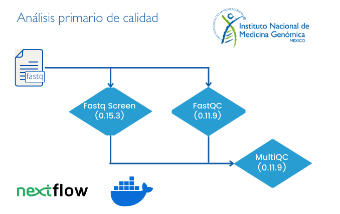

# Análisis de calidad de archivos de secuenciación masiva en formato FASTQ

Este flujo de trabajo realiza la identificación de variantes germinales a partir de archivos de secuenciación masiva en formato **FASTQ**.

## Solicitud de servicio

Este flujo de trabajo se ejecuta como prueba de calidad previa a cualquier flujo de análisis solicitado.

- Archivos de secuenciación **FASTQ** (este flujo está diseñado únicamente para datos Illumina *paired-end*).

## Implementando este flujo por tu cuenta: Instrucciones de uso 

Los archivos que necesitas se describen en el apartado **"Solicitud de servicio"**.

### Requisitos previos

Antes de correr este *pipeline* asegúrate de contar con las siguientes herramientas y archivos:

1. Clonar el repositorio principal siguiendo las instrucciones:

		git clone https://github.com/INMEGEN/Pipelines_INMEGEN.git

2. Verifica si tienes las siguientes herramientas informáticas:
	- [NextFlow](https://www.nextflow.io/docs/latest/index.html) (versión mayor o gual a 22.10.7)
	- [Docker](https://docs.docker.com/) (versión mayor o gual a 23.0.5)
	- Imagen de docker pipelinesinmegen/pipelines_inmegen:public, la puedes descargar con el comando: 

          docker pull pipelinesinmegen/pipelines_inmegen:public

3. Asegurarse de contar con los siguientes archivos, necesarios para el pipeline:
   
	- Referencias de Fastq Screen

Para mayor información consulta el manual de [Fastq Screen](https://stevenwingett.github.io/FastQ-Screen/).

### Ejecutar el flujo de trabajo

Para correr este flujo de trabajo sigue las siguientes instrucciones:

 1. Completar el archivo sample_info.tsv con la información que se describe en la sección - **Formato del archivo sample_info** -
 2. Editar el archivo de nextflow.config con la siguiente información:

	- Ruta del directorio de salida de nextflow (params.outdir)
	- Ruta del archivo sample_info.tsv (params.sample_info)
	- Nombre del proyecto (params.project_name)
	- Ruta absoluta de la ubicación de las referencias de Fastq Screen (params.refdir)
	- Número de núcleos que utilizarán los procesos multi-threading (params.ncrs)
	- En los parámetros para docker, se puede modificar el apartado runOptions la opción --cpus = Número máximo de núcleos por proceso.
	- En los parámetros de Nextflow (executor) solo se puede cambiar la opción queueSize =  Número máximo de procesos que se ejecutarán de forma simultánea

**NOTA:** El número máximo de  procesadores que utilizará tu corrida es: cpus * queueSize. Esto aplica en el caso de los procesos que permitan multi-threading.

**NOTA:** Si ncrsr es mayor que cpus, los procesos multi-threading utilizarán un número máximo de núcleos igual a cpus.

**NOTA:** Los archivos *sample_info.tsv* y *nextflow.config* deben encontrarse en el mismo directorio que el archivo *main.nf*

Para opciones de configuración específicas para tu servidor o cluster puedes consultar la siguiente [liga](https://www.nextflow.io/docs/latest/config.html) 

  3. Ejecutar el comando: 

			bash run_nextflow.sh /path/to/out/dir

### Formato del archivo sample_info

El archivo sample_info.tsv ubicado en la carpeta Fastq-QC es indispensable y debe incluir la siguiente información por columna.

 - **Sample**  = Nombre de la muestra secuenciada. Se recomienda el formato [identificador_numeroDeMuestra]
 - **R1**      = Ruta absoluta del archivo fastq R1 (forward)
 - **R2**      = Ruta absoluta del archivo fastq R2 (reverse)

**Recuerda:** 
- Utilizar letras de la A a la Z (mayúsculas y minúsculas sin acentos)
- No utilizar la letra "ñ"
- Si es absolutamente necesario, puedes emplear los siguientes caracteres especiales (guión -, guión bajo _, punto .)
- No están permitidos los espacios 

A continuación, se muestran algunos ejemplos de cómo se rellenar el contenido del archivo sample_info.tsv.

Ejemplo 1. Si cuentas con muestras con multiples carriles (lanes), debes de incorporar el número de lane al nombre de la muestra:
 
	Sample	R1	R2
	ID_S1_L002	Path/to/fastq_S001_L001_R1.fq	Path/to/fastq_S001_L001_R2.fq
	ID_S1_L002	Path/to/fastq_S001_L002_R1.fq	Path/to/fastq_S001_L002_R2.fq

Ejemplo 2. Si cientas con muestras con un sólo lane.

	Sample	R1	R2
	ID_S1	Path/to/fastq_R1.fq.gz	Path/to/fastq_R2.fq.gz
	ID_S2	Path/to/fastq_R1.fastq.gz	Path/to/fastq_R2.fastq.gz

Como se observa no es necesario que el **Sample_name** coincida con el nombre del archivo que se encuentra en los campos **R1** y **R2**.

**NOTA IMPORTANTE:** Recuerda cada columna del archivo sample_info **DEBE** estar separada por tabulador (\t) y el **encabezado** debe de conservarse exactamente igual al archivo muestra **sample_info.tsv**.

#### Las herramientas utilizadas para correr este flujo de trabajo son:

 - FastQC (0.11.9)
 - FastQ Sreen (4.2.6.1)
 - MultiQC (1.11)

## Diagrama de flujo del pipeline 

