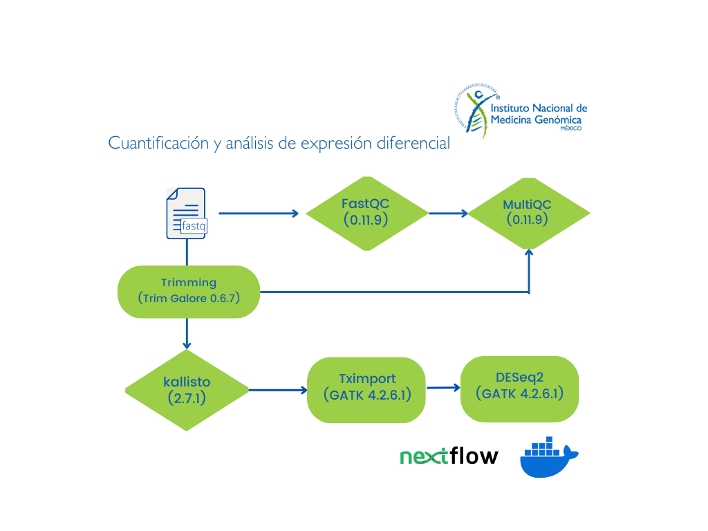

# Flujo de trabajo cuantificación y análisis de expresión diferencial (pipeline Q&DEA)

Este flujo de trabajo realiza la cuantificación de los transcritos y el análisis de expresión diferencial a partir de archivos de secuenciación masiva (*RNA-seq*). 

**Nota:** 
 - Por el momento el análisis sólo está disponible para datos ilummina paired-end 
 - Se puede obtener sólo la matriz de cuentas cruda y TPM o la matriz de cuentas cruda, TPM y el análisis de la expresión diferencial entre dos condiciones distintas.

## Solicitud de servicio

Para solicitar este flujo de trabajo como servicio debes de entregar al personal de INMEGEN: 

- Archivos de secuenciación FASTQ (Illumina paired-end).
- Archivo con la información experimental (identificador de los archivos, nombre de la muestra, condición experimental).

## Implementando este flujo por tu cuenta: Instrucciones de uso 

Los archivos que necesitas se describen en el apartando **"Solicitud de servicio"**.

### Preparar el ambiente de trabajo

1. Te debes asegurar de contar con las siguientes herramientas informaticas:

	- [NextFlow](https://www.nextflow.io/docs/latest/index.html) (22.10.7)
        - [Docker](https://docs.docker.com/) (23.0.5)
        - Imagen de docker pipelinesinmegen/pipelines_inmegen:public, la puedes clonar con el comando:
   

                docker pull pipelinesinmegen/pipelines_inmegen:public

 
3. Asegurarse de contar con los siguientes archivos, necesarios para el pipeline:

   	- Genoma hg38
	- Archivo gtf del genoma
        - Índice de [kallisto](https://pachterlab.github.io/kallisto/manual)
	  En el directorio bin/ se ecnuentra un bash script para descargar la referencia, el archivo gft y generar el índice

 5. Editar el archivo de nextflow.config con la siguiente información:
        - Ruta de los archivos fastq
	- Ruta del directorio de salida de nextflow
	- Nombre del proyecto 
	- Ruta del índice de kallisto
	- Ruta del archivo sample_info.tsv
	- Nombre del índice de kallisto
	- Nombre del archivo gtf (debe de encontrarse en el mismo directorio del índice de kallisto)
	- Ruta de los scripts de R utilizados en este pipeline [directorio R]
	- Condiciones del análisis de expresión diferencial (condiciones a comparar, umbrales y nombres de los archivos de salida)
	- Número de núcleos por proceso (parámetro runOptions) 
        - Número de procesos que se ejecutarán de forma simultánea (parámetro queueSize)

Para opciones de configuración especificas para tu servidor o cluster puedes consultar la siguiente [liga](https://www.nextflow.io/docs/latest/config.html)

  4. Ejecutar el comando: 

                bash run_nextflow.sh /path/to/out/dir

#### Formato del archivo con la información experimental 

Para tener un buen control de los archivos a procesar (formato fastq pareados {Read_1,Read_2}), en el archivo sample_info.tsv incluir la siguiente información por columna:

                        Sample_id       Sample_name     replica         condition       R1      R2

Cada conlumna contine la siguiente información:

 - Sample_id   = Nombre completo de los archivos, se recomienda el formato [identificador único-número de muestra-número de lane]
 - Sample_name = Nombre de la muestras, se recomienda el formato [nombre de la muestra - número de muestra], este nombre es el nombre que aparecerá en los graficos generados
 - replica     = Número de réplica de las muestra o en su número de lote
 - condition   = Describe brevemente la condicion experimental de cada una de las muestras (normal, tratada, tumor, etc)
 - R1          = Ruta absoluta del archivo de lectura en formato fastq R1
 - R2          = Ruta absoluta del archivo de lectura en formato fastq R2

**Nota:** Recuerda que el archivo debe estar separado por tabulador (\t).

## Las herramientas utilizadas por este flujo de trabajo son:
 
 - R (4.2.3) 
 - FastQC (0.11.9) 
 - MultiQC (1.13.deb0)
 - Trim Galore (0.6.7) 
 - Kallisto (0.46.1) 

Además de las herramientas arriba enunciadas, son utilizan las siguientes librerías de R:
 
 - Tximport (1.22.0)
 - readr (2.1.2)
 - BUSpaRse (1.8.0)
 - tximportData (1.22.0)
 - dplyr (1.0.9)
 - DESeq2 (1.34.0)
 - ggplot2 (3.3.6)
 - ggrepel (0.9.1)
 - PCAtools (2.6.0)
 - EnhancedVolcano (1.13.2)
 - optparse (1.7.1)
 - ComplexHeatmap (2.10.0)
 - topGO (2.46.0)
 - GeneTonic (1.6.4)
 - org.Hs.eg.db (3.14.0)
 - org.Mm.eg.db (3.15.0)
 - AnnotationDbi (1.56.2)
 - SummarizedExperiment (1.24.0)
 - rhdf5 (2.38.1)
 - pcaExplorer (2.22.0)

## Diagrama de flujo de análisis

