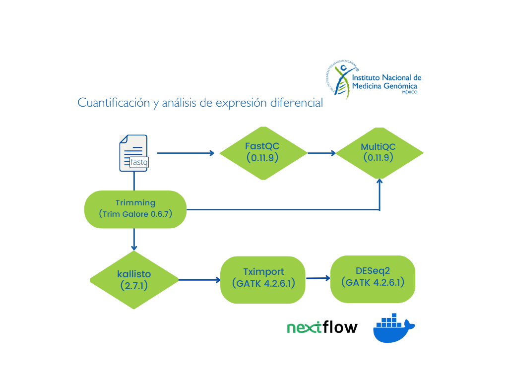

# Flujo de trabajo cuantificación y análisis de expresión diferencial (pipeline Q&DEA)

Este flujo de trabajo realiza la cuantificación de los transcritos y el análisis de expresión diferencial a partir de archivos de secuenciación masiva (*RNA-seq*). 

**Nota:** 
 - Por el momento el análisis sólo está disponible para datos ilummina paired-end 
 - Se puede obtener sólo la matriz de cuentas cruda y la matriz TPM (transcritos por millón) y el análisis de la expresión diferencial entre dos condiciones distintas
 - Se optiene la matriz de cuentas a nivel de gen generada por STAR + FeactureCounts o la cuantificación a nivel de transcrito por Salmon

## Solicitud de servicio

Para solicitar este flujo de trabajo como servicio debes de entregar al personal de INMEGEN: 

- Archivos de secuenciación FASTQ (Illumina paired-end)
- Archivo con la información experimental (identificador de los archivos, nombre de la muestra, condición experimental)

## Implementando este flujo por tu cuenta: Instrucciones de uso 

Los archivos que necesitas se describen en el apartando **"Solicitud de servicio"**.

### Requisitos previos

Antes de correr este pipeline asegúrate de contar con las siguientes herramientas y archivos:

1. Clonar el repositorio principal siguiendo las instrucciones:

		git clone https://github.com/INMEGEN/Pipelines_INMEGEN.git

2. Te debes asegurar de contar con las siguientes herramientas informaticas:
	- [NextFlow](https://www.nextflow.io/docs/latest/index.html) (versión mayor o gual a 22.10.7)
	- [Docker](https://docs.docker.com/) (versión mayor o gual a 23.0.5)
	- Imagen de docker pipelinesinmegen/pipelines_inmegen:public, la puedes clonar con el comando:

          docker pull pipelinesinmegen/pipelines_inmegen:public

3. Asegurarse de contar con los siguientes archivos, necesarios para el pipeline:
	- Genoma hg38
	- Archivo gtf del genoma
	- Índice de [Salmon](https://combine-lab.github.io/alevin-tutorial/2019/selective-alignment/))
	- Referencia de [STAR](https://github.com/alexdobin/STAR/tree/master)

**NOTA:** En el directorio bin/ se ecnuentra un bash script para descargar el genoma de referencia, el cDNA de referencia, el archivo gft, generar el índice de Salmon y generar la referencia de STAR. Adicionalmente, está el archivo de equivalencias entre los GeneID y los TranscriptID junto al archivo de cofiguración de multiqc

### Ejecutar el flujo de trabajo

Para correr este pipeline se deben de ejecutar las siguientes instrucciones:

 1. Completar el archivo sample_info.tsv y metadata.tsv con la información que se describe en la sección **Formato del archivo sample_info** y la sección **Formato del archivo metadata**
 2. Editar el archivo de nextflow.config con la siguiente información:
	- Ruta absoluta del directorio de salida de nextflow (params.outdir)
	- Nombre del proyecto (params.project_name)
	- Ruta absoluta de la ubicación del índice de kallisto del transcriptoma de referencia (params.ref)
	- Ruta absoluta al directorio que contiene el índice de kallisto (params.refdir)
	- Nombre del indice de Salmon sin la ruta absoluta, incluyendo la extensión idx (params.refname)
	- Nombre del archivo gtf sin la ruta absoluta, incluyendo la extensión gtf (params.gtfname)
	- Ruta absoluta al directorio que contiene la referencia de STAR (params.refdir_star)
	- Nombre del genoma de referencia sin la ruta absoluta, incluyendo la extensión fasta (params.refname_star)
	- Ruta del script DEA.R (params.r_DEA)
	- Ruta del script Q.R (params.rQ)
	- Ruta del archivo sample_info.tsv (params.sample_info)
	- Ruta del archivo metadata.tsv (params.metadata)
	- Ruta del directorio que contiene a los scripts DEA.R y Q.R (params.scriptdir) 
	- Elegir si se hará un análisis de expresión diferencial true = sí, false = no (params.QDEA)
	- Número de núcleos que utilizarán los procesos multi-threading (params.ncrs)
	- Condiciones del análisis de expresión diferencial condition_1 vs condition_2 (comparación: params.condition_1 vs params.condition_2)
	- Umbrales del análisis de expresión diferencial LogFC y FDR (params.th_l2fc  y params.th_padj)
	- En los parámetros para docker, se puede modificar el apartado runOptions la opción --cpus = Número máximo de núcleos por proceso.
	- En los parámetros de Nextflow (executor) solo se puede cambiar la opción queueSize = Número máximo de procesos que se ejecutarán de forma simultánea

Para opciones de configuración especificas para tu servidor o cluster puedes consultar la siguiente [liga](https://www.nextflow.io/docs/latest/config.html)

**NOTA:** El número máximo de procesadores que utilizará tu corrida es: cpus * queueSize. Esto aplica en el caso de los procesos que permitan multi-threading.

**NOTA:** El archivo gtf y el indice de Salmon deben ubicarse en el mismo directorio 

**NOTA:** El archivo gtf y la referencia de STAR deben ubicarse en el mismo directorio 

**NOTA:** Los archivos sample_info.tsv, metadata.tsv y nextflow.config deben encontrarse en el mismo directorio que el archivo main.nf.

  3. Ejecutar el comando: 

	bash run_nextflow.sh

### Formato del archivo con la información experimental 

#### Formato del archivo **sample_info**

Para tener un buen control de los archivos a procesar (formato fastq pareados {Read_1,Read_2}), en el archivo sample_info.tsv debe incluir la siguiente información por columna:

 - Sample    = Nombre de la muestras, se recomienda el formato [identificador único o nombre de la muestra]
 - SampleID  = Nombre completo de los archivos, se recomienda el formato [identificador único-número de muestra-número de lane]
 - R1        = Ruta absoluta del archivo de lectura en formato fastq R1
 - R2        = Ruta absoluta del archivo de lectura en formato fastq R2

#### Formato del archivo **metadata**

Para tener un buen control de la información experimental, en el archivo metadata.tsv debe incluir la siguiente información por columna:

 - Sample      =Nombre de la muestras, se recomienda el formato [identificador único o nombre de la muestra]. **(Debe coindicir con la columna Sample del archivo sample_info)** 
 - condition   = Describe la condicion experimental de cada una de las muestras (normal, tratada, tumor, etc)

En caso de que las muestras representen más de una condición experimental se puede añadir tantas columnas como sea necesario, por ejemplo:
 - condition2  = Describe otra la condicion experimental de cada una de las muestras (normal, tratada, tumor, etc) 

**Recuerda:**

- Utilizar letras de la A a la Z (mayúsculas y minúsculas sin aceltos)
- No utilizar la letra "ñ"
- Sólo emplear los siguientes caracterez especiales (guión -, guión bajo _, punto .)
- No están permitidos los espacios

A continuación, se muestran algunos ejemplos de cómo rellenar el contenido del archivo sample_info.tsv.

	Sample	 SampleID	R1	R2
	name1	ID_M1	/pat/to/file1_R1.fq.gz	/pat/to/file1_R2.fq.gz
	name2	ID_M2	/pat/to/file1_R1.fq.gz	/pat/to/file1_R2.fq.gz

 A continuación, se muestran algunos ejemplos de cómo rellenar el contenido del archivo metadata.tsv.

	Sample	condition	condition2
	name1	control	time1
	name2	treated	time2
   
**Nota:** En el archivo metadata.tsv las columnas condition2 ... conditionN son opcionales.
**Nota:** Recuerda que los archivo sample_info y metadata deben estar separados por tabulador (\t).

## Las herramientas utilizadas por este flujo de trabajo son:
 
 - R
 - MultiQC
 - FastQC
 - FastP 
 - Salmon
 - STAR
 - QualiMap
 - FeactureCounts

Además de las herramientas arriba enunciadas, son utilizan las siguientes librerías de R:
 
 - Tximport
 - readr
 - BUSpaRse
 - tximportData
 - dplyr
 - DESeq2
 - ggplot2
 - ggrepel
 - PCAtools
 - EnhancedVolcano
 - optparse
 - ComplexHeatmap
 - AnnotationDbi
 - SummarizedExperiment
 - rhdf5
 - pcaExplorer

## Diagrama de flujo de análisis

