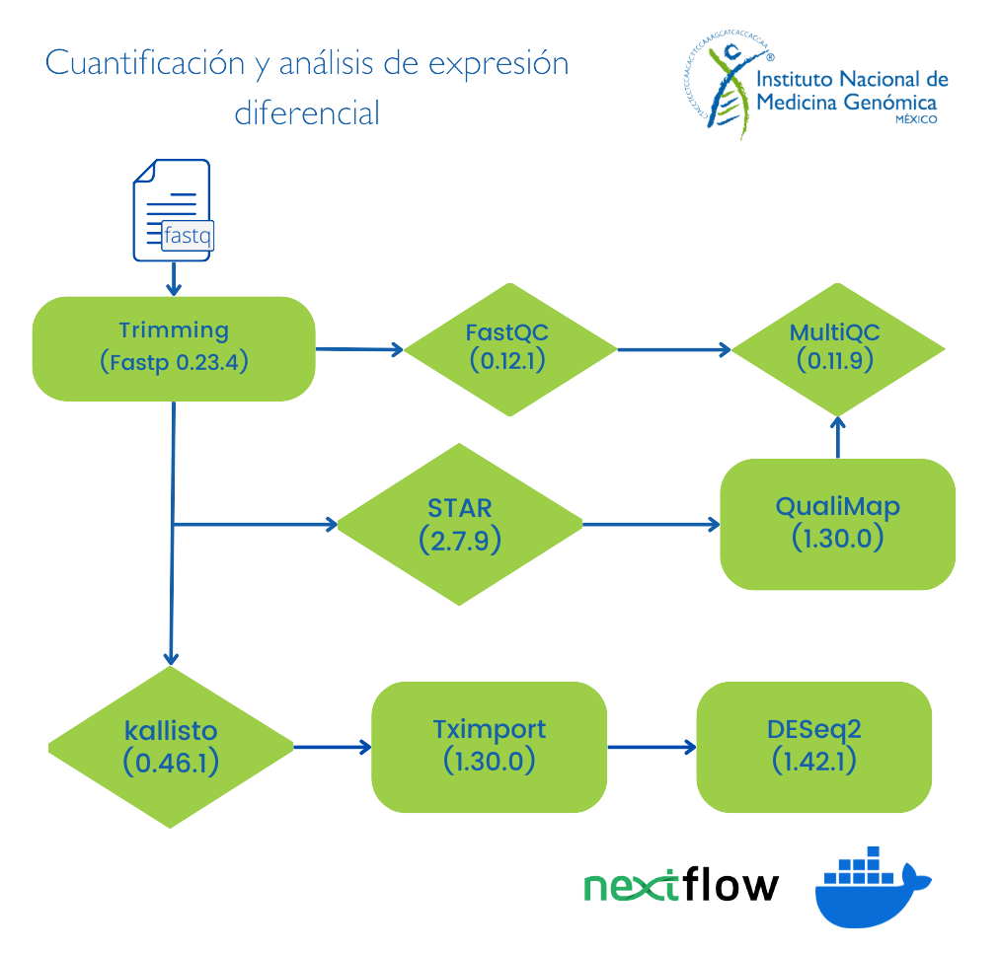

# Flujo de trabajo cuantificación y análisis de expresión diferencial (pipeline Q&DEA)

Con este pipeline se analizan archivos de secuenciación masiva (*RNA-seq*) en un formato *fastq*. Se puede obtener sólo la matriz de cuentas TPM o la matriz de cuentas más el análisis de los genes diferencialmente expresados entre dos condiciones distintas.
Necesitas tus archivos de secuenciación masiva (formato fastq), los nombres de las muestras y la información del arreglo experimental (condiciones a comparar).

**Nota:** Por el momento el análisis sólo está disponible para datos de lectura corta (illumina paired-end).

## Formato del archivo con la información experimental 

Para tener un buen control de los archivos a procesar (formato fastq pareados {Read_1,Read_2}), en el archivo sample_info.tsv incluir la siguiente información por columna: 

			Sample_id	Sample_name	replica		condition	R1	R2

Cada conlumna contine la siguiente información:

 - Sample_id   = nombre de identificación de las muestras
 - Sample_name = nombre común de las muestras (este es el nombre que aparecerá en las gráficas)
 - replica     = describe el número de réplica de las muestras o en su defecto el lote
 - condition    = describe la condicion experimental de cada una de las muestras (normal, tratada, tumor, etc)
 - R1          = ruta absoluta del archivo de lectura en formato fastq R1
 - R2          = ruta absoluta del archivo de lectura en formato fastq R2

**Nota:** Es imprescindible conservar los nombres de las columnas y que esten delimitadas por tabulador.

## Instrucciones de uso 

Primero se debe asegurar que se cuenta con [NextFlow](https://www.nextflow.io/docs/latest/index.html) (22.10.7), [Docker](https://docs.docker.com/) (23.0.5) y la imagen de docker pipelinesinmegen/pipelines_inmegen:latest.
En caso de trabajar con humano en el directorio bin/ se encuentra el archivo para generar la referencia de kallisto.

 1. Seleccionar una ruta y el nombre para el directorio de salida
 2. Después generar el archivo sample_info.csv con la información que se describe en la sección

    - Formato del archivo con la información experimental -

 3. Editar el archivo de nextflow.config con la siguiente información:
        - Ruta de los archivos fastq
	- Ruta del directorio de salida de nextflow
	- Nombre del proyecto 
	- Ruta del índice de kallisto [Para generar el índice de kallisto consultar la siguiente [liga](https://pachterlab.github.io/kallisto/manual)]
	- Ruta del archivo sample_info.csv
	- Nombre del índice de kallisto
	- Nombre del archivo gtf (debe de encontrarse en el mismo directorio del índice de kallisto)
	- Ruta de los scripts de R utilizados en este pipeline [directorio R]
	- Condiciones del análisis de expresión diferencial (condiciones a comparar, umbrales y nombres de los archivos de salida

  4. Ejecutar el comando: 

                bash run_nextflow.sh /path/to/out/dir

## Las herramientas utilizadas por este flujo de trabajo son:

> 
> - R (4.2.3) 
> - FastQC (0.11.9) 
> - MultiQC (1.13.deb0)
> - Trim Galore (0.6.7) 
> - Kallisto (0.46.1)
> 

Además de las herramientas arriba enunciadas, son utilizan las siguientes librerías de R:

> 
> - Tximport (1.22.0)
> - readr (2.1.2)
> - BUSpaRse (1.8.0)
> - tximportData (1.22.0)
> - dplyr (1.0.9)
> - DESeq2 (1.34.0)
> - ggplot2 (3.3.6)
> - ggrepel (0.9.1)
> - PCAtools (2.6.0)
> - EnhancedVolcano (1.13.2)
> - optparse (1.7.1)
> - ComplexHeatmap (2.10.0)
> - topGO (2.46.0)
> - GeneTonic (1.6.4)
> - org.Hs.eg.db (3.14.0)
> - org.Mm.eg.db (3.15.0)
> - AnnotationDbi (1.56.2)
> - SummarizedExperiment (1.24.0)
> - rhdf5 (2.38.1)
> - pcaExplorer (2.22.0)
>

## Diagrama de flujo de análisis

