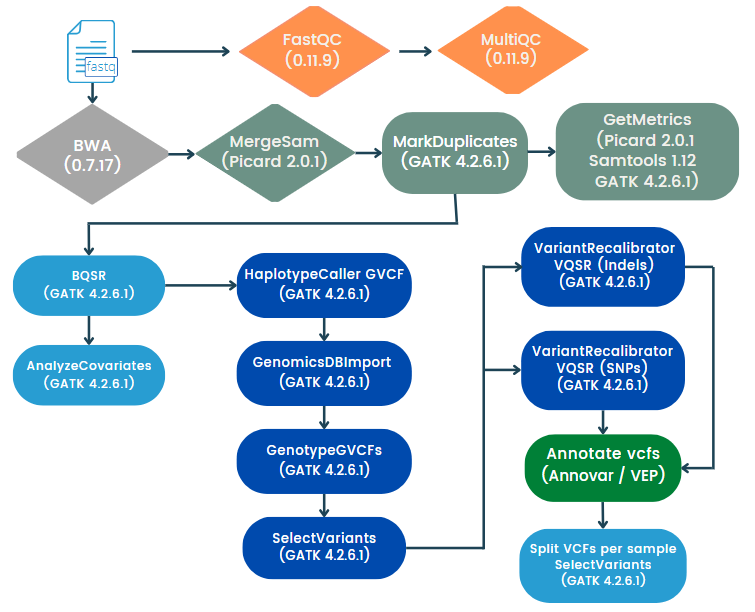

# Identificación conjunta de variantes germinales a partir de datos WGS/WES 

Este flujo de trabajo realiza la identificación conjunta de variantes germinales a partir de archivos de secuenciación masiva (WGS/WES).

**NOTA:** 
 - Por el momento el análisis sólo está disponible para datos ilummina *paired-end* en humano.  
 - Si se desea otra especie revisar el flujo identificación conjunta de variantes germinales a partir de datos WGS/WES con *bootstrapping*. Este flujo se provee como parte de este repositorio pero no ha sido probado por personal del INMEGEN en otras especies.

## Solicitud de servicio

Para solicitar este flujo de trabajo como servicio debes de entregar al personal de INMEGEN: 

- Archivos de secuenciación **FASTQ** (Illumina *paired-end*).
- Archivo con la información experimental (vease la sección: **Formato del archivo sample_info**).
- En caso de *WES* especificar el kit utilizado.

## Implementando este flujo por tu cuenta: Instrucciones de uso 

Los archivos que necesitas se describen en el apartando **"Solicitud de servicio"**.

### Preparar el ambiente de trabajo

1. Te debes asegurar de contar con las siguientes herramientas informaticas:
	- [NextFlow](https://www.nextflow.io/docs/latest/index.html) (22.10.7)
	- [Docker](https://docs.docker.com/) (23.0.5)
	- Imagen de docker pipelinesinmegen/pipelines_inmegen:public, la puedes descargar con el comando: 

                docker pull pipelinesinmegen/pipelines_inmegen:public

2. Asegurarse de contar con los siguientes archivos, necesarios para el pipeline:
	- Genoma hg38
	- Índice del genoma de referencia (generado con SAMTOOLS faidx)
	- Índice de [BWA](https://bio-bwa.sourceforge.net/bwa.shtml)
	- Archivos de recalibración de BQSR y VQSR

**NOTA:** Todos estos archivos se pueden descargar del [bundle de GATK](https://console.cloud.google.com/storage/browser/genomics-public-data/resources/broad/hg38/v0;tab=objects?prefix=&forceOnObjectsSortingFiltering=false). 

**Se recomienda que todos estos archivos se encuentren en el mismo directorio.**

### Ejecutar el flujo de trabajo

Para correr este pipeline se debe clonar este repositorio y ejecutar las siguientes instrucciones:

 1. Completar el archivo sample_info.tsv con la información que se describe en la sección **Formato del archivo sample_info**
    
 2. Editar el archivo de nextflow.config con la siguiente información:

	- Ruta absoluta del directorio de salida de nextflow (params.outdir)
	- Ruta del archivo *sample_info.tsv* (params.sample_info)
	- Ruta absoluta de los archivos *fastq* (params.reads)
	- Nombre del proyecto (params.project_name)
	- Si son múltiples lanes por muestra habilitar la ópción a *true* (params.multiple_lanes)
	- Si el tipo de análisis es dirigido o *WES* mantener esta opción como *true* en caso de el tipo de archivos sea *WGS* cambiar a *false* (params.wes)
	- Ruta absoluta de la ubicación del índice de BWA del genoma de referencia (params.refdir)
	- Nombre del genoma de referencia sin la ruta absoluta, incluyendo la extensión **FASTA** p.j. Genoma_hg38.fasta, Genoma_hg19.fa, etc. (params.refname)
	- Ruta absoluta del archivo *interval_list*, en el caso de *WES* se puede utilizar el archivo **BED** del kit para generarlo, para más información consulta la siguiente [liga](https://gatk.broadinstitute.org/hc/en-us/articles/360035531852-Intervals-and-interval-lists) (params.interval_list)
	- Nombre del archivo *interval_list* (params.intervalname)
	- Ruta absoluta del archivo **BED** utilizado para la secuenciación (params.bed_file)
	- Ruta absoluta del archivo **BED** utilizado para la secuenciación que incluye una ventana de 100 bases (params.bed_filew)
	- Ruta absoluta del archivo **FASTA** con la lista de adaptadores para **Trimmomatic**
	- Número de núcleos que utilizarán los procesos multi-threading (params.ncrs)
	- En los parámetros para docker, se puede modificar el apartado runOptions la opción --cpus = Número máximo de núcleos por proceso.
	- En los parámetros de Nextflow (executor) solo se puede cambiar la opción queueSize = Número máximo de procesos que se ejecutarán de forma simultánea

Para opciones de configuración específicas para tu servidor o cluster puedes consultar la siguiente [liga](https://www.nextflow.io/docs/latest/config.html) 

**NOTA:** El número máximo de procesadores que utilizará tu corrida es: cpus * queueSize. Esto aplica en el caso de los procesos que permitan multi-threading.

**NOTA:** En el caso de *WGS* el bundle de GATK proveé un archivo *interval_list* para optimizar el tiempo de ejecución. Se puede utilizar para crear un archivo **BED** de *WGS*. En caso de WGS utilizar el mismo archivo **BED** en las opciones.

**NOTA:** Los archivos sample_info.tsv y nextflow.config deben encontrarse en el mismo directorio que el archivo main.nf.

  3. Ejecutar el comando:

	bash run_nextflow.sh /path/to/out/dir

### Formato del archivo sample_info

El archivo sample_info.tsv ubicado en la carpeta VC-Germline es indispensable y debe incluir la siguiente información por columna.

 - **Sample_name**  = Nombre de la muestra secuenciada. Se recomienda el formato [identificador_numeroDeMuestra]
 - **SampleID**     = Nombre que identifica a la muestra. Se debe utilizar el formato [Sample_name_numeroDeLane]. Sólo en el caso de que una muestra se encuentra únicamente en UN LANE, el campo **SampleID** debe ser igual al campo **Sample_name**
 - **RG_PU**        = Campo PU del *Read Group* (@RG) de la muestra, está asociado al barcode de la flowcell y al número de lane. Se debe utilizar el formato [flowcell.númeroDeLane]
 - **RG_PL**        = Campo PL del *Read Group* (@RG) de la muestra, está asociado a la tenología de secuenciación ej. ILLUMINA, SOLID, LS454, HELICOS y PACBIO
 - **RG_LB**        = Campo PU del *Read Group* (@RG) de la muestra, está asociado al barcode de la librería de secuenciación
 - **R1**           = Ruta absoluta del archivo fastq R1 (*forward*)
 - **R2**           = Ruta absoluta del archivo fastq R2 (*reverse*)

Para entender el significado de los campos del Read Group (@RG = etiqueta que indentifica a cada muestra) y como obtener la información para los campos **RG_PU**, **RG_PL** y **RG_LB** revisa la siguiente [liga](https://gatk.broadinstitute.org/hc/en-us/articles/360035890671-Read-groups).

**Recuerda:** 
- Utilizar letras de la A a la Z (mayúsculas y minúsculas sin aceltos)
- No utilizar la letra "ñ"
- Sólo emplear los siguientes caracterez especiales (guión -, guión bajo _, punto .)
- No están permitidos los espacios 

A continuación, se muestran algunos ejemplos de cómo rellenar el contenido del archivo sample_info.tsv.

Ejemplo 1, muestras con múltiples lanes:
 
	Sample_name	SampleID	RG_PU	RG_PL	RG_LB	R1	R2
	ID_S001	ID_S001_L001	FLOWCELL.1	ILLUMINA	BARCODE	Path/to/fastq_S001_L001_R1.fq	Path/to/fastq_S001_L001_R2.fq
	ID_S001	ID_S001_L002	FLOWCELL.2	ILLUMINA	BARCODE	Path/to/fastq_S001_L002_R1.fq	Path/to/fastq_S001_L002_R2.fq

Ejemplo 2, muestras con un sólo *lane*:

	Sample_name	SampleID	RG_PU	RG_PL	RG_LB	R1	R2
	ID_S1	ID_S1	FLOWCELL.1	ILLUMINA	BARCODE	Path/to/fastq_S1_R1.fastq	Path/to/fastq_S1_R2.fastq
	ID_S2	ID_S2	FLOWCELL.1	ILLUMINA	BARCODE	Path/to/fastq_S2_R1.fastq	Path/to/fastq_S2_R2.fastq

Ejemplo 3, en caso de no contar con la información del @RG y sea sólo una muestra por *lane*:

	Sample_name	SampleID	RG_PU	RG_PL	RG_LB	R1	R2
	ID_S1	ID_S1	FC00001.1	ILLUMINA	BC0001	Path/to/fastq_R1.fq.gz	Path/to/fastq_R2.fq.gz
	ID_S2	ID_S2	FC00001.1	ILLUMINA	BC0001	Path/to/fastq_R1.fastq.gz	Path/to/fastq_R2.fastq.gz

Como se observa no es necesario que el **Sample_name** coincida con el nombre del archivo que se encuentra en los campos **R1** y **R2**.

**NOTA IMPORTANTE:** Recuerda cada columna del archivo debe estar separada por tabulador (\t) y el **encabezado** debe de conservarse exactamente igual al archivo muestra **sample_info.tsv**.

### Las herramientas utilizadas para correr este flujo de trabajo son:

 - FastQC (0.11.9)
 - MultiQC (1.11)
 - Trimommatic (0.39)
 - Mosdepth (0.3.6)
 - GATK (4.2.6.1)
 - R (4.2.3)
 - BWA (0.7.17)
 - Picard Tools (2.27.5)
 - Samtools (1.12)
 - Bcftools (1.12)

## Diagrama de flujo del pipeline 

 Se anexa el siguiente diagrama de flujo con la descripción completa del pipeline ejecutado. Este pipeline está basado en las buenas prácticas de GATK: [identificación de variantes germinal de GATK](https://gatk.broadinstitute.org/hc/en-us/articles/360035535932-Germline-short-variant-discovery-SNPs-Indels-)

