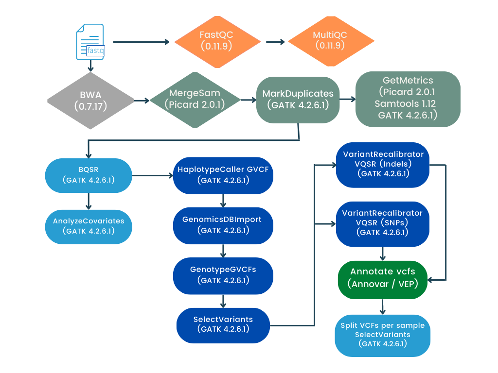

# Flujo de trabajo llamado de variantes de línea germinal utilizando NextFlow y GATK4 (pipeline VC_Germline)

Este pipeline realiza la indentificación conjunta de variantes a partir de archivos de secuenciación masiva (WGS/WES) en un formato *fastq*.

#### Las herramientas utilizadas para correr este flujo de trabajo son:
> 
> - NextFlow (22.04.5)
> - R (4.2.0) 
> - FastQC (0.11.9) 
> - MultiQC (1.11)
> - Openjdk (11.0.13 o superior)
> - GATK (4.2.6.1)
> - BWA (0.7.17-r 1188)
> - Picard Tools (2.0.1)
> - Samtools (1.6.0)
> - SnpEff (5.1)
> - Annovar
> - bcftools (1.14)
> 

Los archivos como el índice de [BWA](http://bio-bwa.sourceforge.net/) y los archivos de recalibración de BQSR y VQSR se pueden descargar del [bundle de GATK](https://console.cloud.google.com/storage/browser/genomics-public-data/resources/broad/hg38/v0;tab=objects?prefix=&forceOnObjectsSortingFiltering=false).  

#### Archivo con la información de las muestras

Para tener un buen control de los archivos a procesar (formato fastq pareados {Read_1,Read_2}), en el archivo sample_info.tsv incluir la siguiente información por columna:

1. Sample_ID -Nombre completo de los archivos e indentificador de las muestras (puede incluir el nombre o indentificador de la muestra, número de muestra y número de lane)

2. Sample_name - Nombre e undetificador de la muestra (puede incluir el nombre o indentificador de la muestra y el número de muestra)

3. RG -ReadGroup name -El nombre del grupo de lectura de las muestras a procesar

4. PU - Plataforma + Libreria + número de lane

5. Ruta absoluta del archivo fastq R1

5. Ruta absoluta del archivo fastq R2

## Instructivo de uso

### Para Ejecutar por primera vez el pipeline 
 
 1. Verificar que el entorno de trabajo cuente con Nextflow (22.10.6) y con docker (23.0.5).
 2. Construir la imagen de docker con el Dockerfile que se encuentra en el directorio docker utilizando:

		docker build -t pipelines_inmegen -f Dockerfile .

    Debes asegurarte que el directorio de docker cuente con suficiente espacio para generar la imagen (~ 6 GB)

 3. Clonar el repositorio del pipeline de interés 
 4. Verificar que el archivo sample_info.tsv tenga la información descrita en la sección anterior
 5. Rellenar las parametros necesarios del archivo nexflow.config (ruta de las referencias y configuración de pipeline)
 6. Ejecutar el pipeline utilizando 

		bash run_nextflow.sh /path/to/out/dir

 7. Revisar los archivos de salida

Cualquier duda adicional escribir al correo de contacto.

## Diagrama de flujo del pipeline 

Para una mayor descripción de la información del pipeline ejecutado se abexa el siguiente diagrama de flujo 

