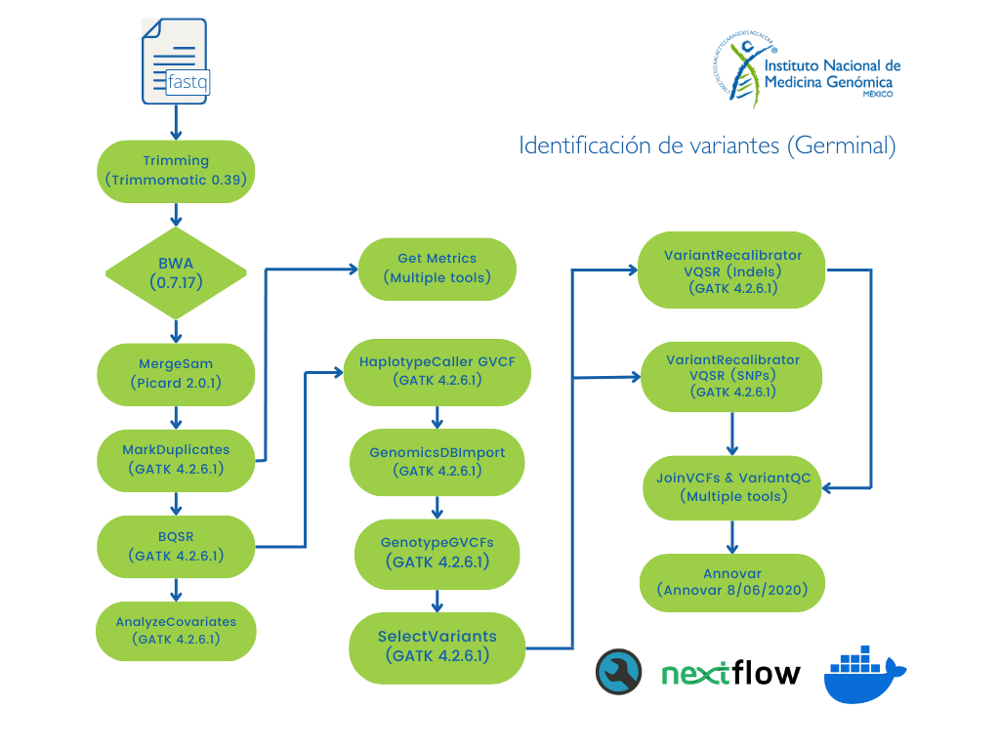

# Flujo de trabajo identificación de variantes de línea germinal utilizando NextFlow y GATK

Este pipeline realiza la identificación conjunta de variantes germinales a partir de archivos de secuenciación masiva (WGS/WES).

**Nota:** Por el momento el análisis sólo está disponible para datos de lectura corta en humano (ilummina paired-end).
**Nota:** Si se desea otra especie revisar el flujo identificación de variantes germinales con bootstrapping.

### Para solicitar este flujo de trabajo como servicio debes de entregar al personal de INMEGEN 

- Archivos de lectura fastq (Illumina paired-end).
- Archivo con la información experimental (identificador de la muestra, plataforma y librería de secuenciación, si son múltiples lanes especificar el número).
- En caso de WES específicar el kit utilizado (para generar un archivo bed).

**Nota:** Estos mismos archivos son necesarios si se desea correr el pipeline de manera independiente.

## Instrucciones de uso 

Si deseas utilizar este flujo de trabajo sin apoyo del personal del INMEGEN sigue las siguientes instrucciones.

Primero se debe asegurar que se cuenta con [NextFlow](https://www.nextflow.io/docs/latest/index.html) (22.10.7), [Docker](https://docs.docker.com/) (23.0.5) y la imagen de docker pipelinesinmegen/pipelines_inmegen:latest. 
En caso de trabajar con el genoma hg38, los archivos como el índice de [BWA](http://bio-bwa.sourceforge.net/) y los archivos de recalibración de BQSR y VQSR se pueden descargar del [bundle de GATK](https://console.cloud.google.com/storage/browser/genomics-public-data/resources/broad/hg38/v0;tab=objects?prefix=&forceOnObjectsSortingFiltering=false). 

 1. Seleccionar una ruta y el nombre para el directorio de salida
 2. Después generar el archivo sample_info.tsv con la información que se describe en la sección - Formato del archivo con la información de las muestras -
 3. Editar el archivo de nextflow.config con la siguiente información:

        - Ruta de los archivos *fastq*
        - Ruta del directorio de salida de nextflow
        - Nombre del proyecto 
        - Ruta del índice de BWA
        - Ruta del archivo sample_info.tsv
        - Nombre del índice de BWA
        - Ruta del archivo con la lista de intervalos
        - Condiciones del análisis (número de núcleos a utilizar por proceso, número de procesos simultáneos e información adicional)

  4. Ejecutar el comando: 

                bash run_nextflow.sh /path/to/out/dir

#### Formato del archivo con la información de las muestras

Para tener un buen control de los archivos a procesar (formato fastq pareados {Read_1,Read_2}), en el archivo sample_info.tsv incluir la siguiente información por columna:
 
		Sample_ID	Sample_name	RG	PU	R1	R2

 - Sample_ID   = Nombre completo de los archivos e identificador de las muestras (debe poseer el nombre o identificador, el número de muestra y número de lane)
 - Sample_name = Nombre o identificador de la muestra (comprende el identificador y el número de muestra)
 - RG          = ReadGroup name -El nombre del grupo de lectura de las muestras a procesar
 - PU          = Plataforma + Libreria + número de lane
 - R1          = Ruta absoluta del archivo fastq R1
 - R2          = Ruta absoluta del archivo fastq R2

#### Las herramientas utilizadas para correr este flujo de trabajo son:

 - FastQC (0.11.9)
 - MultiQC (1.11)
 - Trim Galore (0.6.7)
 - GATK (4.2.6.1)
 - R (4.2.3)
 - BWA (0.7.17)
 - Picard Tools (2.27.5)
 - Samtools (1.12)
 - Bcftools (1.12)

## Diagrama de flujo del pipeline 

Para una mayor descripción de la información del pipeline ejecutado se anexa el siguiente diagrama de flujo basado en las buenas prácticas de GATK.

[Consulta el flujo de identificación de variantes germinal de GATK](https://gatk.broadinstitute.org/hc/en-us/articles/360035535932-Germline-short-variant-discovery-SNPs-Indels-)

