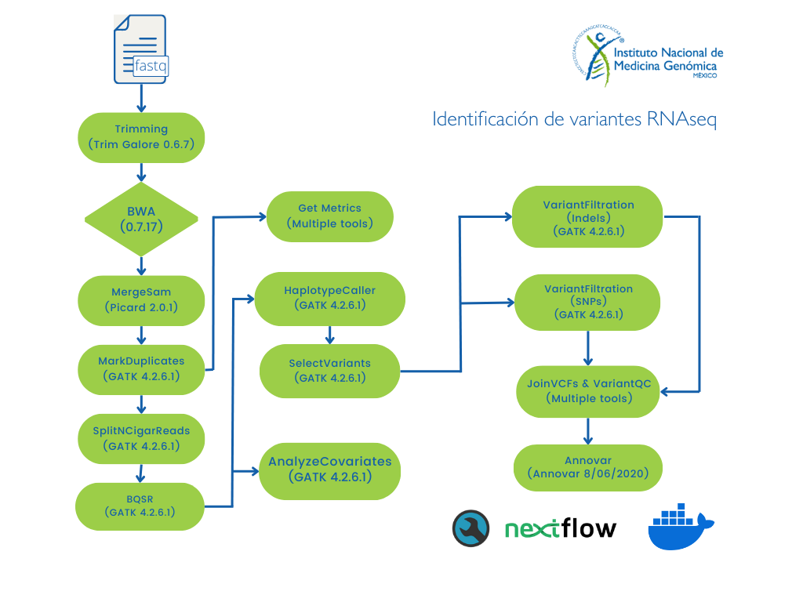

# Identificación de variantes germinales a partir de datos de RNAseq

Este flujo de trabajo realiza la identificación de variantes germinales a partir de archivos de secuenciación masiva (RNA-seq).

**NOTA:** Por el momento el análisis sólo está disponible para datos de lectura corta de humano (Illumina paired-end).

**NOTA:** GATK no soporta  la identificación conjunta de variantes en datos de RNA-seq, consulta el siguiente [link](https://gatk.broadinstitute.org/hc/en-us/articles/360035531192-RNAseq-short-variant-discovery-SNPs-Indels-) para más información.

## Solicitud de servicio

Para solicitar este flujo de trabajo como servicio debes de entregar al personal de INMEGEN: 

- Archivos de secuenciación **FASTQ** (este flujo está diseñado únicamente para Illumina *paired-end*).
- Archivo con la información experimental (vease la sección: **Formato del archivo sample_info**).

## Implementando este flujo por tu cuenta: Instrucciones de uso 

Los archivos que necesitas se describen en el apartado **"Solicitud de servicio"**.

### Requisitos previos

Antes de correr este *pipeline* asegúrate de contar con las siguientes herramientas y archivos:

1. Clonar el repositorio principal siguiendo las instrucciones:

		git clone https://github.com/INMEGEN/Pipelines_INMEGEN.git

2. Verifica si tienes las siguientes herramientas informáticas:
	- [NextFlow](https://www.nextflow.io/docs/latest/index.html) (versión mayor o gual a 22.10.7)
	- [Docker](https://docs.docker.com/) (versión mayor o gual a 23.0.5)
	- Imagen de docker pipelinesinmegen/pipelines_inmegen:public, la puedes descargar con el comando: 

          docker pull pipelinesinmegen/pipelines_inmegen:public

3. Asegurarse de contar con los siguientes archivos, necesarios para el pipeline:
	- Genoma hg38
	- Índice del genoma de referencia (generado con SAMTOOLS faidx)
	- Índice de [STAR](https://physiology.med.cornell.edu/faculty/skrabanek/lab/angsd/lecture_notes/STARmanual.pdf)
	- Los archivos de para la recalibración de BQSR **se pueden descargar del** [bundle de GATK](https://console.cloud.google.com/storage/browser/genomics-public-data/resources/broad/hg38/v0;tab=objects?prefix=&forceOnObjectsSortingFiltering=false).

**NOTA:** El directorio bin contiene un *bash script* para generar el índice de **STAR**. 

**Todos los archivos para BQSR deben encontrarse en el mismo directorio.**

### Ejecutar el flujo de trabajo

Para correr este flujo de trabajo sigue las siguientes instrucciones:

 1. Completar el archivo sample_info.tsv con la información que se describe en la sección - **Formato del archivo sample_info** -
 2. Editar el archivo de nextflow.config con la siguiente información:

	- Ruta del directorio de salida de nextflow (params.outdir)
	- Ruta del archivo sample_info.tsv (params.sample_info)
	- Nombre del proyecto (params.project_name)
	- Si son multiples lanes por muestra habilitar la opción a true (params.multiple_samples)
	- Ruta absoluta de la ubicación del índice de STAR del genoma de referencia (params.refdir_star)
	- Nombre del genoma de referencia usado por STAR sin la ruta absoluta, incluyendo la extensión FASTA p.j. Genoma_hg38.fasta, Genoma_hg19.fa, etc. (params.refname_star)
	- Ruta de los archivos VCFs para la recalibración de las bases (params.ref_dir_bsqr)
	- Número de núcleos que utilizarán los procesos multi-threading (params.ncrs)
	- En los parámetros para docker, se puede modificar el apartado runOptions la opción --cpus = Número máximo de núcleos por proceso.
	- En los parámetros de Nextflow (executor) solo se puede cambiar la opción queueSize =  Número máximo de procesos que se ejecutarán de forma simultánea

**NOTA:** El número máximo de  procesadores que utilizará tu corrida es: cpus * queueSize. Esto aplica en el caso de los procesos que permitan multi-threading.

**NOTA:** Si ncrsr es mayor que cpus, los procesos multi-threading utilizarán un número máximo de núcleos igual a cpus.

**NOTA:** Los archivos *sample_info.tsv* y *nextflow.config* deben encontrarse en el mismo directorio que el archivo *main.nf*

Para opciones de configuración específicas para tu servidor o cluster puedes consultar la siguiente [liga](https://www.nextflow.io/docs/latest/config.html) 

  3. Ejecutar el comando: 

			bash run_nextflow.sh /path/to/out/dir

### Formato del archivo sample_info.

El archivo sample_info.tsv ubicado en la carpeta VC-RNAseq es indispensable y debe incluir la siguiente información por columna.

 - **Sample_name**  = Nombre de la muestra secuenciada. Se recomienda el formato [identificador_numeroDeMuestra]
 - **SampleID**     = Nombre que identifica a la muestra. Se debe utilizar el formato [Sample_name_numeroDeLane]. Sólo en el caso de que una muestra se encuentra únicamente en UN LANE, el campo **SampleID** debe ser igual al campo **Sample_name**
 - **RG_PU**        = Campo PU del *Read Group* (@RG) de la muestra, está asociado al *barcode* de la *flowcell* y al número de *lane*. Se debe utilizar el formato [flowcell.númeroDeLane]
 - **RG_PL**        = Campo PL del *Read Group* (@RG) de la muestra, está asociado a la tenología de secuenciación ej. ILLUMINA, SOLID, LS454, HELICOS y PACBIO
 - **RG_LB**        = Campo PU del *Read Group* (@RG) de la muestra, está asociado al *barcode* de la librería de secuenciación
 - **R1**           = Ruta absoluta del archivo fastq R1 (forward)
 - **R2**           = Ruta absoluta del archivo fastq R2 (reverse)

Para entender el significado de los campos del *Read Group* (@RG = etiqueta que indentifica a cada muestra) y cómo obtener la información para los campos **RG_PU**, **RG_PL** y **RG_LB** revisa la siguiente [liga](https://gatk.broadinstitute.org/hc/en-us/articles/360035890671-Read-groups).

**Recuerda:** 
- Utilizar letras de la A a la Z (mayúsculas y minúsculas sin acentos)
- No utilizar la letra "ñ"
- Si es absolutamente necesario, puedes emplear los siguientes caracteres especiales (guión -, guión bajo _, punto .)
- No están permitidos los espacios 

A continuación, se muestran algunos ejemplos de cómo se rellenar el contenido del archivo sample_info.tsv.

Ejemplo 1, muestras con múltiples lanes:
 
	Sample_name	SampleID	RG_PU	RG_PL	RG_LB	R1	R2
	ID_S001	ID_S001_L001	FLOWCELL.1	ILLUMINA	BARCODE	Path/to/fastq_S001_L001_R1.fq	Path/to/fastq_S001_L001_R2.fq
	ID_S001	ID_S001_L002	FLOWCELL.2	ILLUMINA	BARCODE	Path/to/fastq_S001_L002_R1.fq	Path/to/fastq_S001_L002_R2.fq

Ejemplo 2, muestras con un sólo lane

	Sample_name	SampleID	RG_PU	RG_PL	RG_LB	R1	R2
	ID_S1	ID_S1	FLOWCELL.1	ILLUMINA	BARCODE	Path/to/fastq_S1_R1.fastq	Path/to/fastq_S1_R2.fastq
	ID_S2	ID_S2	FLOWCELL.1	ILLUMINA	BARCODE	Path/to/fastq_S2_R1.fastq	Path/to/fastq_S2_R2.fastq

Ejemplo 3, en caso de no contar con la información del @RG y sea sólo una muestra por lane

	Sample_name	SampleID	RG_PU	RG_PL	RG_LB	R1	R2
	ID_S1	ID_S1	FC00001.1	ILLUMINA	BC0001	Path/to/fastq_R1.fq.gz	Path/to/fastq_R2.fq.gz
	ID_S2	ID_S2	FC00001.1	ILLUMINA	BC0001	Path/to/fastq_R1.fastq.gz	Path/to/fastq_R2.fastq.gz

Como se observa no es necesario que el **Sample_name** coincida con el nombre del archivo que se encuentra en los campos **R1** y **R2**.

**NOTA IMPORTANTE:** Recuerda cada columna del archivo sample_info **DEBE** estar separada por tabulador (\t) y el **encabezado** debe de conservarse exactamente igual al archivo muestra **sample_info.tsv**.

#### Las herramientas utilizadas para correr este flujo de trabajo son:

 - BCFTools (1.19)
 - FastQC (0.11.9)
 - GATK (4.2.6.1)
 - MultiQC (1.11)
 - Picard Tools (2.27.5)
 - R (4.2.3)
 - STAR (2.7.9a)
 - SAMTools (1.12)
 - Trim Galore (0.6.7)

## Diagrama de flujo del pipeline 

Para una mayor descripción de la información del pipeline [consulta el las buenas pŕacticas de gatk para la identificación de variantes de datos de RNAseq](https://gatk.broadinstitute.org/hc/en-us/articles/360035531192-RNAseq-short-variant-discovery-SNPs-Indels-). A continuación se anexa un diagrama de flujo del pipeline ejecutado. 

