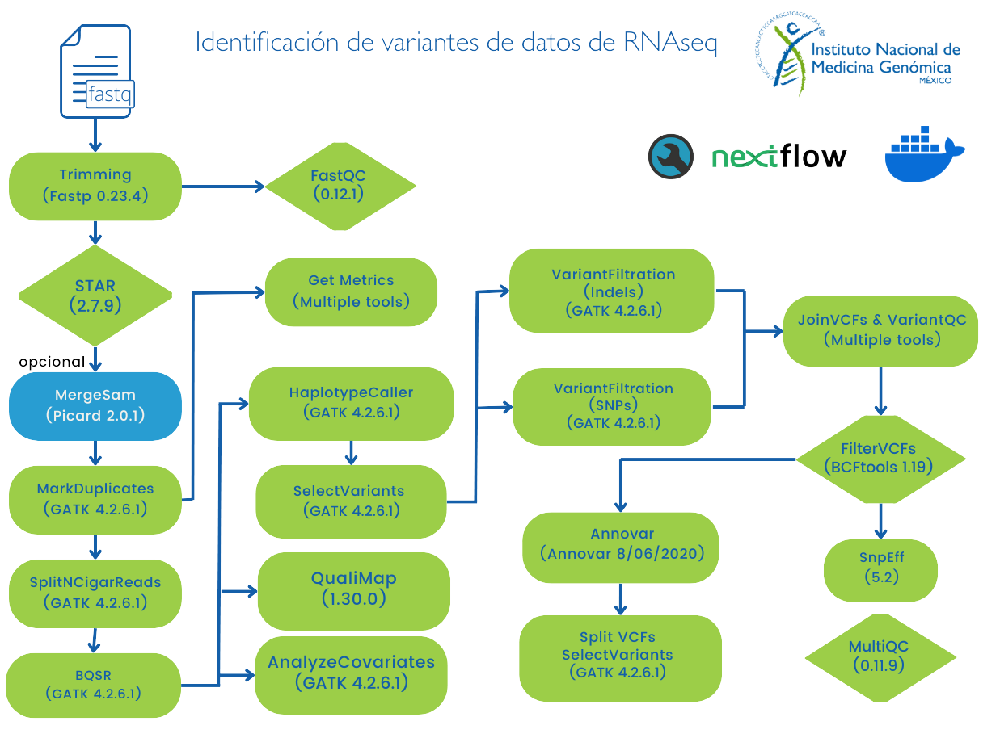

# Flujo de trabajo llamado de variantes de datos RNAseq utilizando NextFlow y GATK4.

Este pipeline realiza la identificación de variantes a partir de archivos de secuenciación masiva (RNA-seq).

**Nota:** Por el momento el análisis sólo está disponible para datos de lectura corta de humano (Illumina paired-end).

**Nota:** GATK no soporta  la identificación conjunta de variantes en datos de RNA-seq, consulta el siguiente [link](https://gatk.broadinstitute.org/hc/en-us/articles/360035531192-RNAseq-short-variant-discovery-SNPs-Indels-) para más información.

## Solicitud de servicio

Para solicitar este flujo de trabajo como servicio debes de entregar al personal de INMEGEN: 

- Archivos de secuenciación FASTQ (este flujo esta diseñado únicamente para Illumina paired-end).
- Archivo con la información experimental (veáse la sección "Formato del archivo con la información experimental").

## Implementando este flujo por tu cuenta: Instrucciones de uso 

Los archivos que necesitas se describen en el apartado **"Solicitud de servicio"**.

### Preparar el ambiente de trabajo

1. Asegurarse de haber clonado el repositorio principal siguiendo las instrucciones [aquí]

2. Te debes asegurar de contar con las siguientes herramientas informaticas:
	- [NextFlow](https://www.nextflow.io/docs/latest/index.html) (22.10.7)
	- [Docker](https://docs.docker.com/) (23.0.5)
	- Imagen de docker pipelinesinmegen/pipelines_inmegen:public, la puedes descargar con el comando: 

                docker pull pipelinesinmegen/pipelines_inmegen:public

3. Asegurarse de contar con los siguientes archivos, necesarios para el pipeline:
	- Genoma hg38
	- Índice del genoma de referencia (generado con SAMTOOLS faidx)
	- Índice de [STAR](https://physiology.med.cornell.edu/faculty/skrabanek/lab/angsd/lecture_notes/STARmanual.pdf)
	- Archivos de recalibración de BQSR y VQSR **se pueden descargar del** [bundle de GATK](https://console.cloud.google.com/storage/browser/genomics-public-data/resources/broad/hg38/v0;tab=objects?prefix=&forceOnObjectsSortingFiltering=false).

**Nota:** El directorio bin contiene un bash script para generar estos acrhivos y sólo resta descargar los archivos para BQSR y VQSR. 
**Se recomienda que todos estos archivos se encuentren en el mismo directorio.**

### Ejecutar el flujo de trabajo

Para correr este pipeline se deben clonar este repositorio y ejecutar las siguientes instrucciones:

 1. Completar el archivo sample_info.tsv con la información que se describe en la sección - Formato del archivo con la información de las muestras -
 2. Editar el archivo de nextflow.config con la siguiente información:

	- Ruta del directorio de salida de nextflow (params.outdir)
	- Ruta del archivo sample_info.tsv (params.sample_sheet)
	- Ruta de los archivos *fastq* (params.reads)
	- Nombre del proyecto (params.project_name)
 	- Si son multiples lanes por muestra (params.multiple_samples)
	- Ruta del índice de STAR del genoma de referencia(params.refdir_star)
	- Nombre del genome de referencia usado por START (sin la ruta, incluyendo la extensión FASTA) (params.refname_star)
 	- Ruta de los archivos para la recalibración de las bases (params.ref_dir_bsqr)
 	- Tenología de secuenciación ej. ILLUMINA, SOLID, LS454, HELICOS y PACBIO (params.pl) 
	- Tipo de secuencidor ej. Nextseq, Hiseq, etc (params.pm)
 	- Número de núcleos por proceso que utilizará STAR (params.ncrs_star)
  	- En los parámetros para docker, solo cambiar en el apartado runOptions --cpus = Número máximo de núcleos por proceso. Si ncrs_star es mayor que cpus, STAR utilizará un número de núcleos igual a cpus
	- En los parámetros de Nextflow (executor) solo cambiar queueSize =  Número de procesos que se ejecutarán de forma simultánea

NOTA: El número máximo de  procesadorres que utilizará tu corrida es: cpus * queueSize. Esto aplica en el caso de los procesos que permitan multi-threading

Para opciones de configuración especificas para tu servidor o cluster puedes consultar la siguiente [liga](https://www.nextflow.io/docs/latest/config.html) 

  3. Ejecutar el comando: 

		bash run_nextflow.sh /path/to/out/dir

#### Formato del archivo con la información experimental

El archivo sample_info.tsv ubicado en la carpeta VC-RNAseq es indispensable y debe incluir la siguiente información por columna. EL ENCABEZADO DE ESTE ARCHIVO ES INDISPENSABLE, LOS NOMBRES DEBEN DE COINCIDIR CON LOS MOSTRADO EN LOS EJEMPLOS:

 - SampleID   = Nombre que identifica a la muestra (letras de la A a la Z, incluyendo mayúsculas y minúsculas, guiones medios, bajos y puntos; cualquier otro caracter está PROHIBIDO: acentos, espacios y ñ's no se permiten. Se recomienda apegarse al formato [{Sample_name}_numeroDeLane]. En caso de que una muestra se encuentra en únicamente UN LANE el SampleID debe ser igual al Sample_name. En caso contrario el SampleID debe apegarse a la convención mencionada [{Sample_name}_numeroDeLane].
 - Sample_name = Nombre que identifica a la muestra. Se recomienda el formato [identificador_numeroDeMuestra]
 - RG.ID          = El campo ID del Read Group de la muestra. Se recomienda el formato [flowcell_lane]. 
 - RG.PU          = El campo PU del Read Group de la muestra. Se recomienda el formato [flowcell_lane]_sample]
 - R1          = Ruta absoluta del archivo fastq R1 (forward)
 - R2          = Ruta absoluta del archivo fastq R2 (reverse)

Para entender el significado de los Read Group revisa la siguiente [liga](https://gatk.broadinstitute.org/hc/en-us/articles/360035890671-Read-groups)

 Ejemplo:
 
		SampleID	Sample_name	RG	PU	R1	R2
  		ID_S001_L001	ID_S001		FLOWCELL_BARCODE_S001	FLOWCELL_BARCODE	Path/to/fastq_R1.fq	Path/to/fastq_R2.fq

En caso de que el nombre del archivo sólo sea ID + lane (ID_L001), agregar S1 a la columna SampleID como se muestra a continuación 

		SampleID	Sample_name	RG	PU	R1	R2
  		ID_S1_L001	ID_S1		FLOWCELL_BARCODE_S1	FLOWCELL_BARCODE	Path/to/fastq_R1.fq	Path/to/fastq_R2.fq

**Nota:** Recuerda que el archivo debe estar separado por tabulador (\t) y el encabezado contener exactamente los mismos términos que los ejemplos.

#### Las herramientas utilizadas para correr este flujo de trabajo son:

 - FastQC (0.11.9)
 - MultiQC (1.11)
 - Trim Galore (0.6.7)
 - GATK (4.2.6.1)
 - R (4.2.3)
 - BWA (0.7.17)
 - Picard Tools (2.27.5)
 - Samtools (1.12)
 - Bcftools (1.12)

## Diagrama de flujo del pipeline 

Para una mayor descripción de la información del pipeline [consulta el las buenas pŕacticas de gatk para la identificación de variantes de datos de RNAseq](https://gatk.broadinstitute.org/hc/en-us/articles/360035531192-RNAseq-short-variant-discovery-SNPs-Indels-). A continuación se anexa un diagrama de flujo del pipeline ejecutado. 

