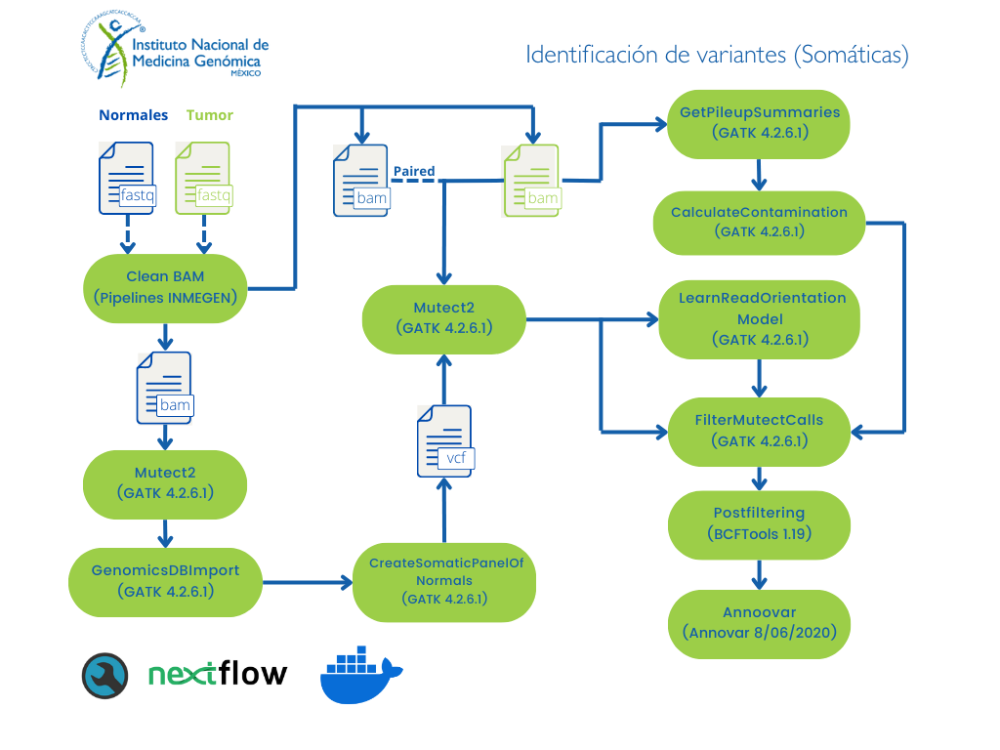

# Identificación de variantes somáticas a partir de datos WES/WGS

Este flujo de trabajo realiza la identificación de variantes somáticas a partir de archivos de secuenciación masiva (WES/WGS) y se divide en 3 subflujos de trabajos correspondientes a una configuración de análisis en específico:

- Modo pareado [vc-paired]
- Modo tumor-only [vc-nonpaired]
- Panel de normales [panelofnormals]

**NOTA:** Por el momento el análisis sólo está disponible para datos ilummina *paired-end* en humano.
Para conocer más sobre la indentificación de variantes somáticas con GATK4 (Mutect2) consulta la siguiente [liga](https://gatk.broadinstitute.org/hc/en-us/articles/360035531132--How-to-Call-somatic-mutations-using-GATK4-Mutect2).

### Modo pareado
Al momento de identificar las variantes somáticas este flujo de trabajo utiliza una muestra normal* y el panel de normales para aumentar la precisión de la identificación de las variantes somáticas.

  ### Modo tumor-only
Con el flujo *tumor-only* se busca identificar las variantes somáticas de datos que no tengan una muestra normal, aquí se utiliza únicamente el panel de normales para distinguir artefactos de secuenciación y las alteraciones no somáticas. 

### Panel de normales
Este flujo consiste en crear un archivo de variantes que se utiliza para distinguir los artefactos de secuenciación y las variantes germinales que derivan de las muestras normales. Para general el VCF denominado panel de normales es necesario tener al menos 40 muestras normales procesadas de la misma manera que las muestras a procesar de tumor.
Para mayor información ver el siguiente [link](https://gatk.broadinstitute.org/hc/en-us/articles/360035890631-Panel-of-Normals-PON-).

*Una muestra **normal** o control se refiere a una muestra secuenciada del mismo paciente que en teoría no tiene alteraciones somáticas.

**Importante**
En el caso de que no contar con 40 muestras normales secuenciadas con las mismas condiciones para generar el panel de normales, se utilizará el que proporciona GATK de 1000 genomas. 

## Solicitud de servicio

Para solicitar este flujo de trabajo como servicio debes de entregar al personal de INMEGEN: 

- Archivos de secuenciación **FASTQ** (Illumina *paired-end*)
- Archivo con la información experimental (los identificadores de las muestras indicando si son normales o de tumor y la información que se señala en la sección: **Formato del archivo sample_info**)
- En caso de *WES* específicar el kit utilizado

## Implementando este flujo por tu cuenta: Instrucciones de uso

Los archivos que necesitas se describen en el apartando "Solicitud de servicio".

### Requisitos previos

Antes de correr este *pipeline* asegúrate de contar con las siguientes herramientas y archivos:

1. Clonar el repositorio principal siguiendo las instrucciones:

		git clone https://github.com/INMEGEN/Pipelines_INMEGEN.git

2. Verifica si tienes las siguientes herramientas informáticas:
	- [NextFlow](https://www.nextflow.io/docs/latest/index.html) (versión mayor o gual a 22.10.7)
	- [Docker](https://docs.docker.com/) (versión mayor o gual a 23.0.5)
	- Imagen de docker pipelinesinmegen/pipelines_inmegen:public, la puedes descargar con el comando: 

          docker pull pipelinesinmegen/pipelines_inmegen:public

3. Asegurarse de contar con los siguientes archivos, necesarios para el pipeline:
	- Genoma hg38
	- Índice del genoma de referencia (generado con SAMTOOLS faidx)
	- Índice de [BWA](https://bio-bwa.sourceforge.net/bwa.shtml)
	- Archivos de recalibración de BQSR y VQSR
	- Archivo [gnomAD VCF](https://gnomad.broadinstitute.org/downloads/)

**NOTA:** Todos estos archivos se pueden descargar del [bundle de GATK](https://console.cloud.google.com/storage/browser/genomics-public-data/resources/broad/hg38/v0;tab=objects?prefix=&forceOnObjectsSortingFiltering=false). **Se recomienda que todos estos archivos se encuentren en el mismo directorio.**

**IMPORTANTE**
Estos flujos de trabajo utiliza archivos bam previamente procesados con el flujo [Data-preprocessing](https://github.com/INMEGEN/Pipelines_INMEGEN/tree/Principal/Data_preprocessing)

### Ejecutar el flujo de trabajo

Para correr este *pipeline* ejecuta las siguientes instrucciones:

 1. Completar el archivo sample_info.tsv con la información que se describe en la sección **Formato del archivo sample_info.**
 2. Editar el archivo de nextflow.config acorde a cada flujo de trabajo con la siguiente información:
	- Ruta del directorio de salida de nextflow (params.outdir)
	- Ruta del archivo sample_info.tsv (params.sample_info)
	- Nombre del proyecto (params.project_name)
	- Si el tipo de análisis es dirigido o WES mantener esta opción como true en caso de el tipo de archivos sea WGS cambiar a false (params.wes)
	- Ruta absoluta de la ubicación del índice de BWA del genoma de referencia (params.refdir)
	- Nombre del genoma de referencia sin la ruta absoluta, incluyendo la extensión FASTA p.j. Genoma_hg38.fasta, Genoma_hg19.fa, etc. (params.refname)
Ruta absoluta del archivo interval_list, en el caso de WES se puede utilizar el archivo BED del kit para generarlo, para más información consulta la siguiente [liga](https://gatk.broadinstitute.org/hc/en-us/articles/360035531852-Intervals-and-interval-lists) (params.interval_list)
	- Nombre del archivo gnomAD VCF que contiene la frecuencia alélica descargado del bundle de GATK (params.onlygnomad) **regularmente se llama af-only-gnomad.hg38.vcf.gz**
	- Ruta absoluta del panel de normales (params.panel_normales)
	- Ruta absoluta del índice del panel de normales (params.panel_normales_idx)
	- Ruta absoluta del archivo VCF con los sitios variantes germinales comunes, **este archivo debe de contar con la frecuencia alélica (AF) en el campo INFO**(params.common_biallelic) **regularmente se llama common_biallelic.vcf.gz**
	- Ruta absoluta del índice del VCF con los sitios variantes germinales comunes (params.common_biallelic_idx)
	- Número de núcleos que utilizarán los procesos multi-threading (params.ncrs)
	- Número de muestras utilizadas para crear el panel de normales (params.batchsize)
	- En los parámetros para docker, se puede modificar el apartado runOptions la opción --cpus = Número máximo de núcleos por proceso.
	- En los parámetros de Nextflow (executor) solo se puede cambiar la opción queueSize = Número máximo de procesos que se ejecutarán de forma simultánea

Para opciones de configuración específicas para tu servidor o cluster puedes consultar la siguiente [liga](https://www.nextflow.io/docs/latest/config.html)

**NOTA:** El número máximo de procesadores que utilizará tu corrida es: cpus * queueSize. Esto aplica en el caso de los procesos que permitan multi-threading.

**NOTA:** En el caso de *WGS* el bundle de GATK proveé un archivo interval_list para optimizar el tiempo de ejecución. Se puede utilizar para crear un archivo **BED** de *WGS*.

**NOTA:** Los archivos sample_info.tsv y nextflow.config deben encontrarse en el mismo directorio que el archivo main.nf.

  4. Ejecutar el comando correspondiente a cada subflujo de trabajo: 

	bash run_nextflow.sh /path/to/out/dir

### Formato del archivo con la información experimental

##### Panel de normales 

Para tener un buen control de los archivos a procesar (formato bam), el archivo sample_info.tsv debe de incluir la siguiente información por columna:

 - Sample   =  Nombre que identifica a la muestra normal.
 - Path     =  Ruta absoluta del archivo bam de la muestra normal.

 EL archivo sample_info.tsv tendrá la siguiente forma
 
		Sample	Path
		Normal_ID	/path/to/bam

##### Modo pareado

Para tener un buen control de los archivos a procesar (formato bam), el archivo sample_info.tsv debe de incluir la siguiente información por columna:

 - Tumor_ID    = Nombre que identifica a la muestra tumor.
 - Tumor_Path  = Ruta absoluta del archivo bam de la muestra Tumor_id
 - Normal_ID   = Nombre que identifica a la muestra normal
 - Normal_Path = Ruta absoluta del archivo bam de la muestra Normal_id

		Tumor_ID	Tumor_Path	Normal_ID	Normal_Path
		Tumor_sample_id	/path/to/tumor/bam/file/Tumor_sample_id.bam	Normal_sample_id	/path/to/tumor/bam/file/Normal_sample_id.bam

**Nota:** Los identificadores por renglón deben de pertenecer al mismo paciente.
       
##### Modo unpaired       

Para tener un buen control de los archivos a procesar (formato bam), el archivo sample_info.tsv debe de incluir la siguiente información por columna:

 - Tumor_ID    = Nombre que identifica a la muestra tumor.
 - Tumor_Path  = Ruta absoluta del archivo bam de la muestra Tumor_id
 
                Tumor_id        Tumor_Path
		Tumor_sample_id	/path/to/tumor/bam/file/Tumor_sample_id.bam

**NOTA IMPORTANTE:** Recuerda cada columna del archivo sample_info **DEBE** estar separada por tabulador (\t) y el **encabezado** debe de conservarse exactamente igual al archivo muestra **sample_info.tsv**.

#### Las herramientas utilizadas para correr este flujo de trabajo son:

 - BCFTools (1.19)
 - GATK (4.2.6.1)
 - R (4.2.3)
 - Picard Tools (2.27.5)

## Diagrama de flujo del pipeline 

Para una mayor descripción de la información del pipeline ejecutado se anexa el siguiente diagrama de flujo basado en [las buenas prácticas de GATK](https://gatk.broadinstitute.org/hc/en-us/articles/360035894731-Somatic-short-variant-discovery-SNVs-Indels-).

