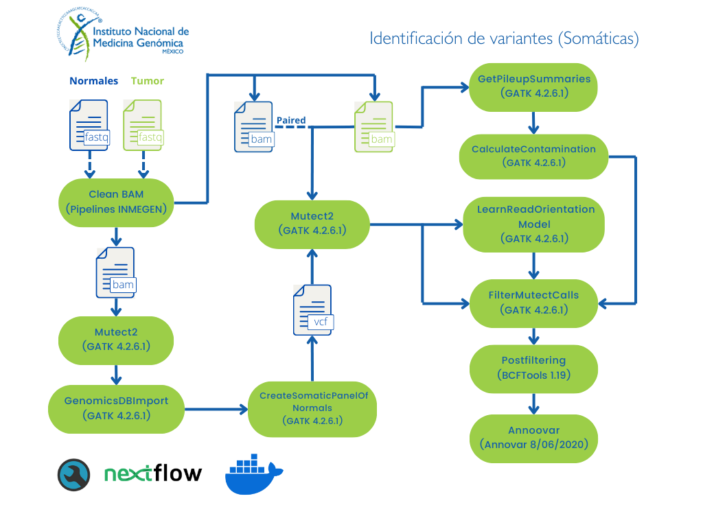

# Flujo de trabajo identificación de variantes somáticas utilizando NextFlow y GATK

Este pipeline realiza la identificación de variantes somáticas a partir de archivos de secuenciación masiva (WGS/WES) y se divide en 3 subflujos de trabajos correspondientes a una configuración de análisis en específico:

        - Panel de normales [PON]
        - Modo tumor-only [vc-nonpaired]
        - Modo pareado [vc-paired]

	### Panel de normales
Para distinguir las variantes que derivan de las muestras normales (tejido sano que no tiene alteraciones somáticas) de las muestras tumorales se utiliza esta herramienta. Para general el VCF denominado panel de normales es necesario tener al menos 40 muestras normales procesadas de la misma manera que las muestras a procesar (tumor). 
Para mayor información ver el siguiente [link](https://gatk.broadinstitute.org/hc/en-us/articles/360035890631-Panel-of-Normals-PON-).

	### Modo tumor-only
Este flujo de trabajo identifica las variantes somáticas utilizando únicamente el panel de normales para distinguir las alteraciones no somáticas.

	### Modo pareado
Adicional al panel de normales, al momento de identificar las variantes somáticas este flujo de trabajo utiliza una muestra normal correspondiente al mismo paciente pero que no sea de tejido tumoral. Esto aumenta la precisión de la identificación de variantes somáticas.

Para conocer más sobre la indentificación de variantes somáticas con GATK4 (Mutect2) consulta la siguiente [liga](https://gatk.broadinstitute.org/hc/en-us/articles/360035531132--How-to-Call-somatic-mutations-using-GATK4-Mutect2).

**Nota:** En el caso de que no contar con 40 muestras normales secuenciadas con las mismas condiciones para generar el panel de normales, se utilizará el que proporciona GATK de 1000 genomas. 
**Nota:** Por el momento el análisis sólo está disponible para datos de lectura corta (ilummina paired-end).

### Para solicitar este flujo de trabajo como servicio debes de entregar al personal de INMEGEN 

- Archivos de lectura fastq (Illumina paired-end).
- Archivo con la información experimental (identificador de la muestra, plataforma y librería de secuenciación, si son múltiples lanes especificar el número).
- En caso de WES especificar el kit utilizado y los identificadores de las muestras indicando si son normales o de tumor.

**Nota:** Esta información también es necesaria para utilizar los flujos de trabajo de sin asistencia.

## Instrucciones de uso 

Si deseas utilizar este flujo de trabajo sin apoyo del personal del INMEGEN sigue las siguientes instrucciones.
Primero asegurar que se cuenta con la instalación de [NextFlow](https://www.nextflow.io/docs/latest/index.html) (22.10.7), [Docker](https://docs.docker.com/) (23.0.5) y la imagen de docker pipelinesinmegen/pipelines_inmegen:latest.

En caso de trabajar con el genoma hg38, los archivos como el índice de [BWA](http://bio-bwa.sourceforge.net/) y los archivos de recalibración de BQSR y VQSR se pueden descargar del [bundle de GATK](https://console.cloud.google.com/storage/browser/genomics-public-data/resources/broad/hg38/v0;tab=objects?prefix=&forceOnObjectsSortingFiltering=false). 
Estos flujos de trabajo utilizan archivos bam previamente procesados con el pipeline de preprocesamiento de datos [Data_preprocessing].

 1. Seleccionar una ruta y el nombre para el directorio de salida
 2. Después generar el archivo sample_*.tsv con la información que se describe en la sección - Formato del archivo con la información de las muestras -
 3. Editar el archivo de nextflow.config con la siguiente información:

	- Ruta de los archivos *fastq*
	- Ruta del directorio de salida de nextflow
	- Nombre del proyecto 
	- Ruta del índice de BWA
	- Ruta del archivo sample_*.tsv
	- Nombre del índice de BWA
	- Ruta del archivo con la lista de intervalos
	- Ruta del directorio de annovar
	- Parámetros de mutect2
	- Condiciones del análisis (número de núcleos a utilizar por proceso, número de procesos simultáneos e información adicional)

  5. Ejecutar el comando correspondiente a cada subflujo de trabajo: 

                bash run_nextflow.sh /path/to/out/dir

### Formato del archivo con la información experimental

##### Panel de normales 

Para tener un buen control de los archivos a procesar (formato bam), el archivo sample_*.tsv debe de incluir la siguiente información por columna:
 
		Sample	Path	

 - Sample   = Nombre completo de los archivos e identificador de las muestras normales (debe de contener el nombre o identificador de la muestra)
 - Path     = Ruta absoluta del archivo bam de la muestra sample

##### Modo paired
Para tener un buen control de los archivos a procesar (formato bam), el archivo sample_*.tsv debe de incluir la siguiente información por columna:
 
                Tumor_id	Tumor_Path	Normal_id	Normal_Path     

 - Tumor_id    = Nombre de los archivos e identificador de las muestras de tumor (debe de contener el nombre o identificador de la muestra)
 - Tumor_Path  = Ruta absoluta del archivo bam de la muestra Tumor_id
 - Normal_id   = Nombre de los archivos e identificador de las muestras normales (debe de contener el nombre o identificador de la muestra)
 - Normal_Path = Ruta absoluta del archivo bam de la muestra Normal_id

**Nota:** Los identificadores por renglón deben de pertenecer a la misma muestra (paciente)
       
##### Modo unpaired       

Para tener un buen control de los archivos a procesar (formato bam), el archivo sample_*.tsv debe de incluir la siguiente información por columna:
 
                Tumor_id        Tumor_Path

 - Tumor_id    = Nombre de los archivos e identificador de las muestras de tumor (debe de contener el nombre o identificador de la muestra)
 - Tumor_Path  = Ruta absoluta del archivo bam de la muestra Tumor_id

#### Las herramientas utilizadas para correr este flujo de trabajo son:

 - GATK (4.2.6.1)
 - R (4.2.3)
 - Picard Tools (2.27.5)

## Diagrama de flujo del pipeline 

Para una mayor descripción de la información del pipeline ejecutado se anexa el siguiente diagrama de flujo basado en las buenas prácticas de GATK.
[Consulta el flujo de identificación de variantes somáticas de GATK](https://gatk.broadinstitute.org/hc/en-us/articles/360035894731-Somatic-short-variant-discovery-SNVs-Indels-)

